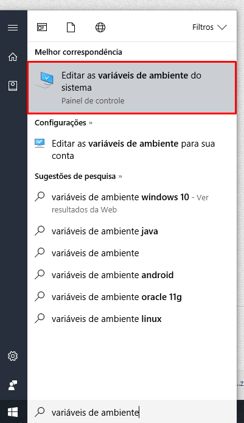

# Instalando dependências necessárias

### Tesseract

Após baixar o Tesseract [neste link](http://digi.bib.uni-mannheim.de/tesseract/tesseract-ocr-setup-4.00.00dev.exe), instale-o seguinto o protocolo básico de "próximo/próximo/concluído".

### Image Magick

No caso do Image Magick, baixe a versão portátil [neste link](https://www.imagemagick.org/download/binaries/ImageMagick-7.0.6-10-portable-Q16-x86.zip) e extraia para `C:/imagemagick`.

### Node.js

Baixe o Node.js na versão recomendável para a maioria dos usuários através do site que pode ser acessado [neste link](http://nodejs.org) e siga o mesmo esquema de instalação (próximo/próximo/concluído).

## Adicionando ao PATH

1 - Acesse a barra de busca do windows e pesquise por "Variáveis de Ambiente", abra o "Editar variáveis de ambiente do sistema".

2 - Clique no botão "Variáveis de ambiente" e edite a variável "PATH"

3 - Clique no botão "Novo", digite `C:/` e clique em procurar, abra a pasta `C:/imagemagick` onde foi instalado o Image Magick.

4 - Repita o procedimento anterior para o Tesseract, que vai estar em `C:\Program Files (x86)\Tesseract-OCR`

